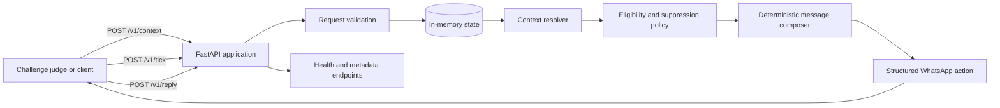

# Build Vera Better Bot

A deterministic FastAPI service for the magicpin “Build Vera Better” challenge. The service receives category, merchant, customer, and trigger context; turns that context into WhatsApp-ready actions; and handles merchant replies with a small, explicit intent router.

The implementation is deliberately self-contained. It does not call an external LLM, WhatsApp API, database, or third-party service at runtime.

## 1. Implementation details

### Context ingestion and versioning

The `/v1/context` endpoint accepts one context record at a time. Records are keyed by `(scope, context_id)` and stored in memory. The supported scopes are:

- `category`
- `merchant`
- `customer`
- `trigger`

Each record includes a version. A newer version replaces the existing record, while an equal or older version is rejected as `stale_version`. This makes repeated delivery safe and provides deterministic behavior when context arrives out of order.

### Trigger processing

`/v1/tick` receives the current timestamp and a list of available trigger IDs. For each trigger, the service resolves the associated merchant, category, and optional customer context. It then:

1. Validates that the required context exists.
2. Applies trigger-specific eligibility and suppression rules.
3. Selects a merchant-facing or customer-facing composition path.
4. Generates a structured action containing the message, sender identity, CTA, template, conversation ID, and suppression key.

Only facts present in pushed context are used when composing a message. The composer includes category-specific offers, merchant metrics, customer details, language preference, and trigger information where available.

### Message composition

The composition layer is deterministic and template-driven. It includes separate paths for:

- Merchant messages sent as Vera.
- Customer messages sent on behalf of the merchant.
- Trigger-specific CTAs and template names.
- English and lightweight Hinglish variants.
- Formatting helpers for percentages, money, names, metrics, and offers.

Messages are kept short and action-oriented so they can be used as WhatsApp drafts without additional transformation.

### Duplicate suppression

Every proactive action receives a `suppression_key`. Keys already sent during the process lifetime are tracked in `sent_suppression_keys`, preventing duplicate actions from being emitted on later ticks.

### Reply handling

`/v1/reply` stores conversation turns and routes messages through explicit rules:

- Opt-out or hostile language closes the conversation and suppresses future proactive sends for that merchant.
- WhatsApp-style auto-replies cause progressively longer waits and eventually end the conversation after repeated signals.
- Explicit positive intent such as “yes” or “go ahead” moves the conversation toward execution.
- Off-topic questions are acknowledged and redirected to the original Vera task.
- Deferrals such as “later”, “busy”, or “tomorrow” produce a wait action.
- Unclassified replies receive one concise follow-up asking for a clear yes/no signal.

### Operational endpoints

- `GET /v1/healthz` — health and in-memory context counts.
- `GET /v1/metadata` — team, model, version, and submission metadata.
- `POST /v1/context` — push or update a versioned context record.
- `POST /v1/tick` — generate proactive actions for available triggers.
- `POST /v1/reply` — handle a merchant conversation turn.
- `POST /v1/teardown` — clear in-memory state for test isolation.

FastAPI request validation errors are returned as HTTP 400 responses with a consistent JSON shape: `accepted: false`, `reason: validation_error`, and validation details.

## 2. Engineering decisions

### Deterministic behavior over model variability

The challenge requires repeatable outputs and predictable handling of edge cases. A rule-based composer avoids network failures, latency, hallucinated facts, and non-repeatable model output while still demonstrating context-aware engagement logic.

### In-memory state for the challenge runtime

The judge keeps the service process alive across context pushes, ticks, and replies. In-memory dictionaries and sets are therefore sufficient and keep the project easy to run. For production, these stores should move to a durable shared datastore so state survives restarts and scales across instances.

### Explicit version checks

Context updates can arrive more than once or out of order. Rejecting stale versions prevents an old payload from overwriting newer business data without requiring a database transaction.

### Separation of policy and copy

Eligibility, suppression, CTA selection, and intent routing are separate from message composition. This makes business rules easier to test and allows copy changes without rewriting state management.

### Conservative use of context

The service does not infer missing business facts. If the merchant, category, or required trigger context is unavailable, it skips the action. This avoids sending messages with fabricated details.

### Safe conversation behavior

Opt-outs, repeated automated replies, and deferrals are treated as first-class states. This reduces spam risk and ensures that a merchant can stop proactive engagement.

### Render-friendly process model

The service binds to `0.0.0.0` and reads Render’s dynamic `$PORT`. The included `render.yaml` defines the build command, start command, health check, and environment variables.

## 3. Tech stack

| Layer | Technology | Purpose |
| --- | --- | --- |
| Language | Python 3.10+ | Application implementation |
| API framework | FastAPI 0.115.6 | HTTP routing, OpenAPI support, and async handlers |
| Server | Uvicorn 0.34.0 | ASGI process serving the API |
| Validation | Pydantic 2.10.4 | Typed request models and input validation |
| State | Python dictionaries and sets | Versioned contexts, suppression, and conversation state |
| Testing utility | `judge_simulator.py` | Local challenge scenario and scoring support |
| Deployment | Render Web Service | Public process hosting |

Pinned runtime dependencies are listed in `requirements.txt`.

## 4. System architecture



### Runtime flow

1. A client pushes versioned context through `/v1/context`.
2. The context store accepts only newer versions for each scope and ID.
3. A tick references trigger IDs; the resolver joins trigger, merchant, category, and customer records.
4. Policy checks determine whether an action should be sent.
5. The composer creates the correct audience, copy, CTA, and suppression key.
6. The reply router updates conversation state and returns `send`, `wait`, or `end` actions.

### State model

```text
contexts[(scope, context_id)]
  -> version, payload, delivered_at

sent_suppression_keys
  -> keys for proactive actions already emitted

merchant_opt_outs
  -> merchant IDs that requested no further proactive messages

conversation_state[conversation_id]
  -> turns, sent message bodies, and detected auto-replies
```

The current architecture is intentionally single-process. A production deployment with multiple workers would require shared storage for these four state collections and an atomic suppression operation.

## Run locally

```bash
python -m pip install -r requirements.txt
uvicorn bot:app --host 0.0.0.0 --port 8080
```

Verify the service:

```bash
curl http://localhost:8080/v1/healthz
curl http://localhost:8080/v1/metadata
python judge_simulator.py
```

The simulator can run operational scenarios without an LLM key. Scored model-comparison runs may require the API key described by the simulator’s configuration.

## Configuration

Copy `.env.example` values into the hosting provider’s environment configuration:

- `TEAM_NAME`
- `TEAM_MEMBERS`
- `CONTACT_EMAIL`
- `MODEL_NAME`
- `SUBMITTED_AT`

For local development, copy `.env.example` to `.env` and set `LLM_API_KEY` only if you run the optional LLM-backed judge simulator. `.env` is ignored by Git; never commit it. The API service loads `.env` with `python-dotenv` when `bot.py` starts.

The judge simulator also reads `BOT_URL`, `LLM_PROVIDER`, `LLM_API_KEY`, `LLM_MODEL`, and its runtime limits from the same environment file.

The deterministic API itself does not require an LLM API key.

## Deploy on Render

The repository includes `render.yaml` for a Render Blueprint.

1. Push the repository to GitHub.
2. Create a Render Web Service or use **New > Blueprint**.
3. Select the repository and apply `render.yaml`.
4. Set the team and contact environment variables in Render.
5. Verify `https://<service-name>.onrender.com/v1/healthz`.

Equivalent manual settings are:

```text
Build command: pip install -r requirements.txt
Start command: uvicorn bot:app --host 0.0.0.0 --port $PORT
Health check: /v1/healthz
```

The submission URL should be the public base URL only, without an endpoint suffix.
